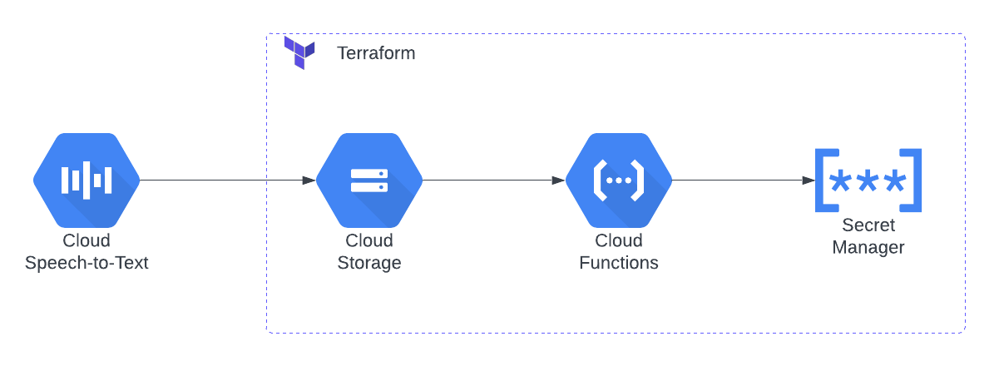

# topics-extractor
This project demonstrates how to use LangChain with Gemini (or any other LLM) to extract topics from transcripts in a cloud-based, serverless environment. The extracted topics can then be further leveraged to auto-generate hashtags for short videos, store insights in a database, or enable further content analysis.

The main concept is to automate topic generation from transcribers (speech-to-text services) where this approach commonly employs [topic modeling](https://www.datacamp.com/tutorial/what-is-topic-modeling) techniques like Latent Semantic Analysis (LSA) to identify the core subjects within the content of a transcript.



You can execute the script locally by adding your Gemini API key to the `.env` file, there's also a [Jupyter Notebook](./topics_extractor.ipynb) available. Optionally, you can deploy the serverless function on GCP by following the [steps](./serverless/README.md) where you'll apply some Terraform code to create the resources (without the speech to text service) then test by upload a `.txt` file to the cloud bucket which will trigger the function.

If you wanted to use ChatGPT instead of Gemini, just replace the following lines in the `main.py` file and replace `GOOGLE_API_KEY` with `OPENAI_API_KEY` in the `.env` file.
```
# from langchain_google_genai import GoogleGenerativeAI # Comment this
from langchain_openai import OpenAI

# llm = GoogleGenerativeAI(model="gemini-pro") # Comment this
llm = OpenAI()
```