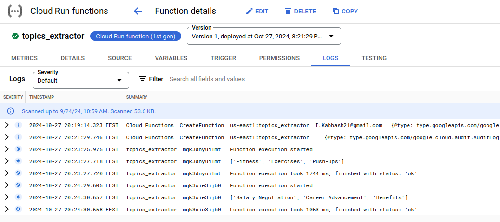

# Cloud Function
The Cloud Function processes uploaded `.txt` files in a specified Cloud Storage bucket, extracting topics based on the content of the `.txt` file. It calls Gemini using the API key stored in the secret manager and returns an array of topics.

The Terraform code creates the following:
- Cloud storage bucket
    - The files uploaded will trigger the function
- Cloud storage bucket object
    - To upload the zip file that contains the code
- Cloud secret manager
    - Contains the Gemini API key
- IAM roles for the default service accounts
    - One with `roles/artifactregistry.reader` and the other with `roles/secretmanager.secretAccessor`
- Cloud function

## Steps
1. Create a new separate GCP project

2. Switch the project using `gcloud` and enable the following APIs
    ```
    gcloud config set project [project_id]

    gcloud services enable run.googleapis.com \
        cloudbuild.googleapis.com \
        compute.googleapis.com \
        storage.googleapis.com \
        artifactregistry.googleapis.com \
        cloudfunctions.googleapis.com \
        secretmanager.googleapis.com
    ```

3. Compress `main.py` and `requirements.txt` into `topics_extractor.zip`
    ```
    zip topics_extractor.zip requirements.txt main.py
    ```

4. Add your Gemini API key and Google project ID into `.tfvars`

5. Create the resources
    ```
    terraform init
    terraform apply -var-file=".tfvars"
    ```

6. Go to Cloud Functions in the Google Console, click on the `topics_extractor` function then switch to the logs

7. To trigger the function, upload any of the `.txt` files in the data directory of the repo (or create your own transcript) to the `cloud-function-bucket-${random_id.rand_id.hex}` bucket
    ```
    # You can either upload in the console or use the following command
    gcloud storage cp /path/to/your-file gs://$(terraform output -raw cloud_function_bucket_name)
    ```

8. Refresh the logs in the console

    

## Things To Consider
Remember that this is just a proof of concept, its not efficient to use Cloud Function V1 (which is also called Cloud Run functions) with bucket storage trigger despite it being straightforward because if you have a case where you want the function to be triggered due to a file added in a specific directory within the bucket, consider using Cloud Function V2 with Pub/Sub.